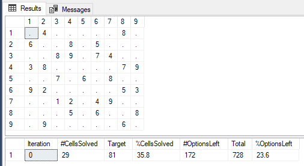
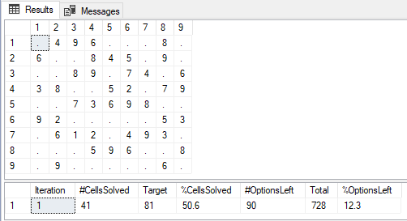
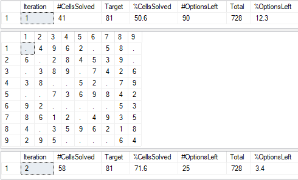
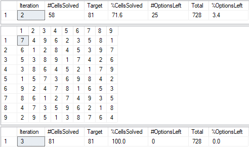

# sql-sudo-solver

Just wanted to see what it would take to solve Sudoku puzzles in T-SQL.

## Getting started

Run the Setup.sql script from the Install-folder to create the Sudoku database and initialize its tables.

Save a new puzzle like this:

``` T-SQL
USE Sudoku
GO

DECLARE @Puzzle varchar(110) 

SET @Puzzle = '
040000080
600805000
008907400
380000079
007060800
920000053
001204900
000506008
090000060'

EXEC Save_Puzzle @Puzzle
GO
```

Start & solve the last saved puzzle:

``` T-SQL
USE [Sudoku]
GO

EXEC Start_Puzzle 

EXEC Solve_Puzzle
```
Results from Start_Puzzle ...



Results from Solve_Puzzle ...




